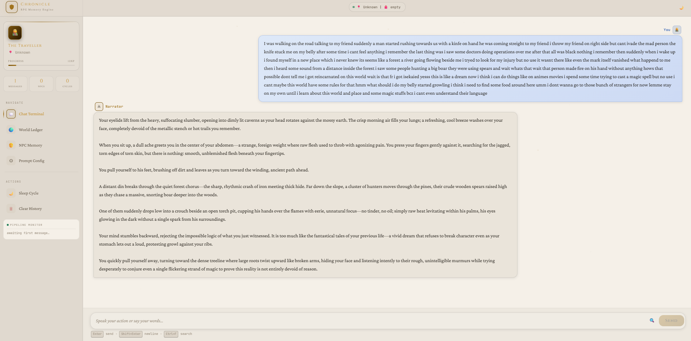

# 🧠 Dynamic RPG AI Companion

### *An Agentic Roleplay Framework*

Persistent memory • Evolving lore • Autonomous world updates

    

---

# 🌌 Chronicle Narrator Model

This project now includes a dedicated RPG narration model:

## 🤗 Hugging Face

👉 **GWsuryaYT/chronicle-narrator-gguf**

A lightweight narrative-focused RPG model tuned for:

* Immersive fantasy narration
* Persistent world storytelling
* Dynamic memory-based roleplay
* Atmospheric prose generation
* JSON world-state updates

---

# 🦙 Use With Ollama

## 📥 Pull Directly From Hugging Face

```bash
ollama create chronicle-narrator -f chronicle-narrator.Modelfile
```

Then run:

```bash
ollama run chronicle-narrator
```

---

# 🧩 Example Generation Style

```txt
The tavern falls silent as Arthur unsheathes the Silver Sword.
The steel catches the firelight like liquid moonlight while nearby mercenaries exchange uneasy glances.
Somewhere deeper in the tavern, an old bard quietly stops singing.
Even the air itself feels heavier.
```

---

# ✨ Overview

Most AI chats forget everything after a few messages.

This project experiments with something different:

> A persistent RPG-style AI world that grows over time.

Instead of treating every interaction as isolated, the system stores memories, updates lore, tracks relationships, and retrieves only the most relevant context when generating responses.

The goal is to create roleplay experiences that feel:

* 🧠 Consistent
* 🌍 Alive
* 📚 Lore-driven
* ⚡ Efficient
* 🤖 Autonomous

---

# 🖼️ Screenshots

## 💬 Live Roleplay Interface


---

## 🌍 Dynamic World State

---

# 🚀 Core Features

## 🌍 Persistent World State

The AI maintains a continuously evolving world model stored in JSON.

### Tracks

* Player progression
* NPCs and factions
* Locations and kingdoms
* Inventory and quests
* Lore and world events
* Dynamic entities and relationships

The world grows naturally as conversations continue.

---

## 📚 Intelligent Lore Retrieval

### *(Librarian Agent)*

Instead of injecting entire chat histories every turn, the system retrieves only relevant memories.

### The Librarian Agent

* Detects important entities
* Finds related lore
* Retrieves useful memories
* Injects focused context into prompts

### Benefits

* Better response quality
* Lower token usage
* Cleaner prompts
* Longer playable sessions
* More coherent storytelling

---

## 💤 Autonomous Sleep Cycle

A background agent periodically reviews recent conversations and extracts meaningful information.

### Automatically Detects

* New lore
* Character development
* Relationship changes
* Story progression
* World updates
* Important events

Small talk and irrelevant fluff are ignored.

This creates a self-maintaining memory system.

---

## 🧠 Hybrid Memory Architecture

The project combines multiple memory systems:

### 📖 Episodic Memory

Stores raw conversation history for short-term continuity.

### 🌍 Structured World Memory

Persistent JSON-based world state for lore and progression.

### 🔗 Relational Graph Memory

Symbolic triplet storage for relationships and reasoning.

Example:

```txt
(Arthur) -[owns]-> (Silver Sword)
(King Aldor) -[rules]-> (Valoria)
(Evelyn) -[hates]-> (The Crimson Order)
```

---

## 🖥️ Desktop GUI

Includes a lightweight Tkinter interface with:

* 💬 Real-time chat
* 📜 Persistent history
* 🌍 Dynamic world summaries
* ⚡ Threaded execution
* 🧠 Background memory processing
* 📚 Live lore updates

---

# 🏗️ Architecture

```txt
User Input
    ↓
Librarian Agent
    ↓
Context Retrieval
    ↓
Prompt Assembly
    ↓
LLM Generation
    ↓
Memory Storage
    ↓
Background Sleep Cycle
```

---

# 📂 Project Structure

```txt
project/
│
├── main_gui.py
├── agent_pipeline.py
├── memory_manager.py
├── world_state.py
├── config.py
│
├── data_history.json
├── data_graph.json
└── data_world.json
```

---

# ⚙️ How It Works

## 1️⃣ User Sends Message

```txt
"I ask the tavern keeper about the Crimson Order."
```

---

## 2️⃣ Librarian Agent Activates

The system scans the message and determines:

* Relevant entities
* Important lore
* Useful memories to retrieve

---

## 3️⃣ Context Assembly

The prompt is built using:

* Recent dialogue
* Relevant memories
* Player state
* World lore

---

## 4️⃣ AI Response Generation

The LLM generates a context-aware response.

---

## 5️⃣ Memory Persistence

The interaction is saved into:

* Chat history
* World state memory
* Relational graph memory

---

## 6️⃣ Autonomous Sleep Cycle

Every few interactions, the background agent analyzes conversations and evolves the world automatically.

---

# 🧪 Example Memory Evolution

## Interaction

```txt
User:
"I give Arthur the Silver Sword."
```

## Stored Memory

```txt
(Arthur) -[owns]-> (Silver Sword)
```

## Future Recall

```txt
Arthur proudly unsheathes the Silver Sword you once gifted him.
```

---

# 🚀 Installation

## Requirements

* Python 3.10+
* Ollama
* Local LLM

---

## 📥 Install Ollama

Download:

👉 [https://ollama.com](https://ollama.com)

---

## 📦 Install Dependencies

```bash
pip install ollama
```

---

## 🤖 Install Chronicle Narrator Model

Place the provided Modelfile in your project folder.

Then run:

```bash
ollama create chronicle-narrator -f chronicle-narrator.Modelfile
```

Launch:

```bash
ollama run chronicle-narrator
```

---

# ⚙️ Model Configuration

The model is tuned specifically for immersive RPG narration.

### Base Model

* Llama-3.1-8B-Instruct

### Training

* SFT (3 epochs)
* DPO (1 epoch)

### Tuned Parameters

```txt
Temperature: 0.9
Top-p: 0.92
Top-k: 40
Repeat penalty: 1.15
Context window: 8192
```

Optimized for:

* 8gb VRam GPUs
* Local storytelling setups
* Long-form roleplay sessions
* Atmospheric narrative generation

---

# 🧠 Philosophy

Most AI systems are reactive.

This project experiments with something closer to:

> Persistent intelligence.

Not just:

```txt
User → Prompt → Response
```

But:

```txt
Remember → Evolve → Adapt → Persist
```

The long-term vision is an AI storytelling engine capable of sustaining deep roleplay sessions across massive timelines without collapsing under context limitations.

---

# ⚠️ Notes

This is an experimental project.

Expect:

* Bugs
* Hallucinations
* Chaotic memory mutations
* Weird emergent behavior
* Inconsistent lore updates

Sometimes the unpredictability becomes part of the story.

---

# ❤️ Contributing

Contributions and experiments are welcome — especially around:

* AI memory systems
* Agentic architectures
* Persistent AI worlds
* Symbolic + LLM hybrid systems
* Autonomous storytelling

Fork it, experiment, and build weird things.

---

# 📜 License

MIT License

---

# 🌌 Persistent Worlds. Persistent Memory. Persistent Storytelling.

### If this project interests you, consider giving it a ⭐
